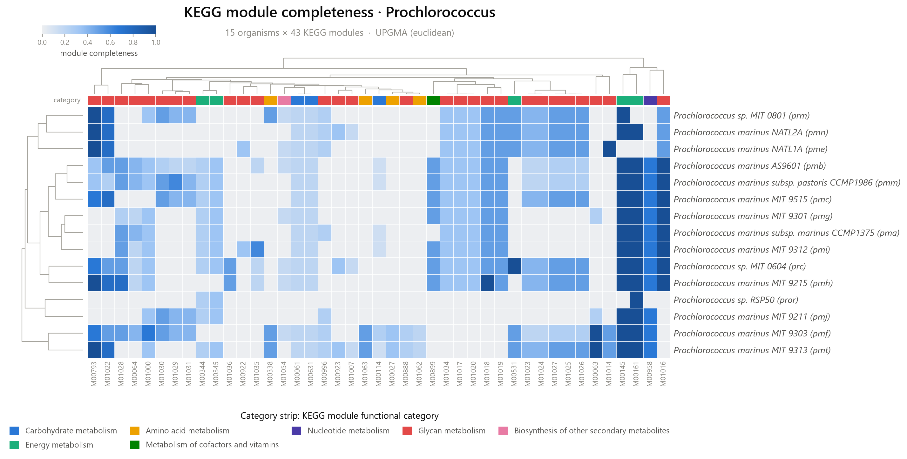

# Metabolic Pathway Presence Heatmap (MPPH)

[](https://github.com/DeweyYihengDu/Metabolic-Pathway-Presence-Heatmap/actions/workflows/ci.yml)
[](https://www.python.org/)
[](LICENSE)
[](https://doi.org/10.1101/2023.06.27.546232)

MPPH profiles KEGG metabolism across a set of genomes and renders a
category-aware heatmap with UPGMA dendrograms. It works two ways:

- **Pathway-map association** — for each genome, whether KEGG provides an
  organism-specific version of a pathway map. This means the pathway *has some
  annotated KOs*, **not** that the complete pathway is present. By default only
  `Metabolism` top-level pathways are kept.
- **Module completeness** — the fraction of each KEGG *module*'s reaction steps
  covered by an organism's KO repertoire (0–1), a far more quantitative signal
  and the recommended mode for metabolic-capability analysis.

It runs on genomes **KEGG already has**, on an explicit **list of organism
codes**, or on **your own MAGs** via their KO annotations. The clustered
dendrogram reflects **functional-profile similarity**, and should not be read as
a sequence-based species phylogeny without external validation.

<p align="center">
  <br>
  <em>Pathway presence — cells coloured by KEGG functional category.</em>
</p>
<p align="center">
  <br>
  <em>Module completeness — sequential ramp, category strip on top.</em>
</p>

## Features

- **Two analyses** — pathway presence/absence *or* KEGG module completeness.
- **Three input sources** — a taxon name, a file of organism codes, or your own
  KO annotations (KofamScan / eggNOG / any `K#####` list).
- **Category-aware figures** — a functional-category colour strip + legend,
  gridded cells, UPGMA dendrograms, italic organism labels.
- **Newick export** (`--newick`) — the pathway/module tree for iTOL / FigTree.
- **Informative-feature filtering** — `--drop-core`, `--min/--max-prevalence`,
  and automatic removal of aggregate "Global and overview maps".
- **Robust & reproducible** — on-disk KEGG caching, retries, a run
  `manifest.json` recording the KEGG release, filters, and organism list.

## Installation

```bash
git clone https://github.com/DeweyYihengDu/Metabolic-Pathway-Presence-Heatmap.git
cd Metabolic-Pathway-Presence-Heatmap
pip install .          # or: pip install -e ".[dev]" for development
```

This installs the `mpph` command. Requires Python 3.9+.

## Usage

```bash
# Pathway presence across a genus (clustered, drop pan-conserved pathways)
mpph Prochlorococcus --cluster --drop-core

# KEGG module completeness, focused on variable modules, export the tree
mpph Prochlorococcus --completeness --cluster --min-prevalence 0.1 \
     --max-prevalence 0.9 --newick

# An explicit set of KEGG organism codes
mpph --codes my_codes.txt --cluster

# Your own MAGs: a directory with one KO list per genome (implies completeness)
mpph --user annotations/ --cluster --format png pdf
```

`mpph` and `python -m mpph` are equivalent.

### Key options

| Option | Description |
| --- | --- |
| `taxon` | Taxon name to query. `--match {word,prefix,exact,regex}` (default `word`). |
| `--codes FILE` / `--user PATH` | Use organism codes, or your own KO annotations (mutually exclusive with a taxon). |
| `--completeness` / `--all-modules` | Score module completeness (0–1); by default only `Pathway` modules. |
| `--top-category` / `--all-categories` | Restrict presence mode to a BRITE top-level category (default `Metabolism`). |
| `--cluster` / `--metric` | UPGMA-cluster both axes. Metric defaults to `jaccard` (presence) / `euclidean` (completeness); also `dice`, `hamming`, `braycurtis`, `cosine`. |
| `--newick` | Export organism and feature trees as `.nwk`. |
| `--drop-core`, `--min/--max-prevalence`, `--present-threshold` | Filter uninformative features by prevalence. |
| `--format {pdf,png,svg}`, `--outdir DIR` | Figure format(s) and output directory. |
| `--refresh`, `--no-cache`, `--cache-dir` | Control KEGG response caching. |

Run `mpph --help` for the full list.

## Input for your own MAGs

`--user` accepts either:

- **a directory** with one file per genome/MAG (the file stem is the sample
  name); each file is scanned for KO ids, so KofamScan `--format mapper` output
  (`gene<TAB>K#####`) or a bare KO list both work; or
- **a single `sample<TAB>KO` table** (long form).

For eggNOG-mapper output, extract the `KEGG_ko` column into per-sample lists
first.

## Output

For a run on `<name>`, MPPH writes to the output directory:

| File | Contents |
| --- | --- |
| `<name>_matrix.csv` | Organism × feature matrix (0/1 presence, or 0–1 completeness). |
| `<name>_features.csv` | Feature id → name → functional category → top category. |
| `<name>_qc.csv` | Per-organism annotated-feature count and status. |
| `<name>_heatmap.<fmt>` | The figure. |
| `<name>_ordered_matrix.csv`, `<name>_row_order.csv`, `<name>_col_order.csv` | Clustered order, so every column in the figure is traceable. |
| `<name>_organism_tree.nwk`, `<name>_feature_tree.nwk` | Newick trees (with `--newick`). |
| `<name>_manifest.json` | Full command, KEGG release, filters, excluded organisms, output list. |

## How it works

1. Resolve organisms from a taxon (`list/genome`), a code file, or user KO files.
2. **Presence:** fetch each organism's pathway list (`list/pathway/<code>`).
   **Completeness:** fetch module definitions (`get/md:` in batches of 10) and
   each organism's KO set (`link/ko/<code>`), then score each module — top-level
   steps split on spaces, `,`=OR, `+`=AND, `-`=optional, `--`=gap (excluded),
   and nested `M#####` references resolved recursively.
3. Assemble and filter the matrix (top-level category, overview maps, empty
   genomes, prevalence).
4. Render the heatmap, clustering when `--cluster` is set, coloured by KEGG
   functional category (`br08901` / module `CLASS`).

## Limitations

- **`pathway-map` ≠ complete pathway.** A `1` means KEGG lists an
  organism-specific map (some KOs annotated), not that the whole pathway is
  functional. Use `--completeness` for capability analysis.
- **Functional similarity ≠ phylogeny.** The dendrogram clusters KEGG functional
  profiles; horizontal transfer, niche convergence, gene loss, annotation
  coverage and genome completeness all affect it. Validate against a reference
  tree before making evolutionary claims.
- **Annotation depth varies** between genomes, and a MAG's missing features may
  reflect incomplete assembly rather than true absence.
- **Taxon matching is by organism name**, so it is reliable for genus/species
  but not for family/phylum. Results depend on the KEGG release (recorded in the
  manifest).

## Citation

> Y.-H. Du and J.-H. Mu, "Metabolic-Pathway-Presence-Heatmap (MPPH):
> Constructing phylogenetic trees based on metabolic pathways," bioRxiv, Jun.
> 2023. doi:[10.1101/2023.06.27.546232](https://doi.org/10.1101/2023.06.27.546232)

## License

Released under the [MIT License](LICENSE).
