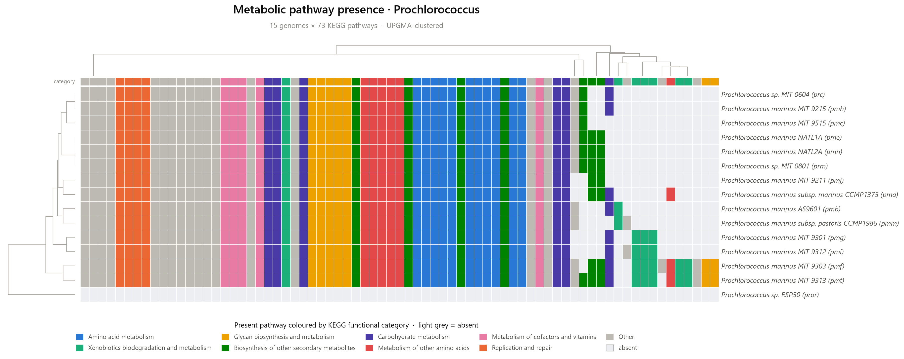

# Metabolic Pathway Presence Heatmap (MPPH)

[](https://www.python.org/)
[](LICENSE)
[](https://doi.org/10.1101/2023.06.27.546232)

MPPH queries the [KEGG REST API](https://www.kegg.jp/kegg/rest/keggapi.html) for
every sequenced genome in a taxon (genus, family, phylum, …), builds a
**metabolic-pathway presence/absence matrix**, and renders a heatmap. With
`--cluster` the rows and columns are hierarchically clustered (UPGMA), turning
the heatmap into a **pathway-based phylogenetic tree** — the idea introduced in
the accompanying preprint.

<p align="center">
  
</p>

## Features

- **One command, any taxon** — matches by whole word so `Vibrio` no longer
  accidentally pulls in `Vibrionimonas`.
- **Clustered heatmap + dendrogram** (`--cluster`) in a single figure.
- **Informative-pathway filtering** (`--drop-core`, `--min-prevalence`) so the
  plot highlights what actually distinguishes the taxa instead of the core
  metabolism everyone shares.
- **On-disk KEGG caching** — re-runs are instant and gentle on KEGG's servers.
- **Robust networking** — timeouts + automatic retry with backoff.
- **Reproducible outputs** — matrix CSV, pathway-name lookup, a run
  `manifest.json`, and figures in PDF/PNG/SVG.

## Installation

```bash
git clone https://github.com/DeweyYihengDu/Metabolic-Pathway-Presence-Heatmap.git
cd Metabolic-Pathway-Presence-Heatmap
pip install -r requirements.txt
```

Requires Python 3.8+.

## Usage

```bash
# Basic: every KEGG genome in the genus Vibrio
python mpph.py Vibrio

# Clustered heatmap, drop pathways shared by all organisms, PNG + PDF
python mpph.py Prochlorococcus --cluster --drop-core --format png pdf

# Match a full "Genus species", write to a custom directory
python mpph.py "Vibrio cholerae" --exact --outdir results
```

### Options

| Option | Description |
| --- | --- |
| `taxon` | Taxon name to query (positional, required). |
| `--exact` | Match names that *start with* the taxon (e.g. a full `Genus species`). |
| `--cluster` | Hierarchically cluster rows/columns (UPGMA) and draw dendrograms. |
| `--drop-core` | Drop pathways present in **all** organisms (uninformative). |
| `--min-prevalence` / `--max-prevalence` | Keep pathways within a prevalence range (0–1). |
| `--format {pdf,png,svg}` | One or more figure formats (default `pdf`). |
| `--outdir DIR` | Output directory (default `output`). |
| `--cache-dir DIR` / `--no-cache` | Control KEGG response caching. |

Run `python mpph.py --help` for the full list.

## Output

For a query on `<taxon>`, MPPH writes to the output directory:

| File | Contents |
| --- | --- |
| `<taxon>_matrix.csv` | Organism × pathway presence/absence matrix (0/1). |
| `<taxon>_pathways.csv` | KEGG map id → pathway name lookup. |
| `<taxon>_heatmap.<fmt>` | The heatmap figure. |
| `<taxon>_manifest.json` | Query parameters, date, KEGG endpoint, matrix size. |

## How it works

1. Fetch the KEGG genome list (`list/genome`) and select organisms whose name
   matches the taxon.
2. For each organism, fetch its pathway list (`list/pathway/<code>`) and reduce
   each id to its 5-digit KEGG map number so pathways are comparable.
3. Assemble the presence/absence matrix and optionally filter by prevalence.
4. Render the heatmap, clustering both axes when `--cluster` is set.

## Citation

If you use MPPH in your research, please cite:

> Y.-H. Du and J.-H. Mu, "Metabolic-Pathway-Presence-Heatmap (MPPH):
> Constructing phylogenetic trees based on metabolic pathways," bioRxiv, Jun.
> 2023. doi:[10.1101/2023.06.27.546232](https://doi.org/10.1101/2023.06.27.546232)

## License

Released under the [MIT License](LICENSE).
