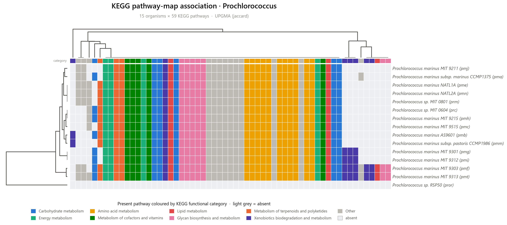
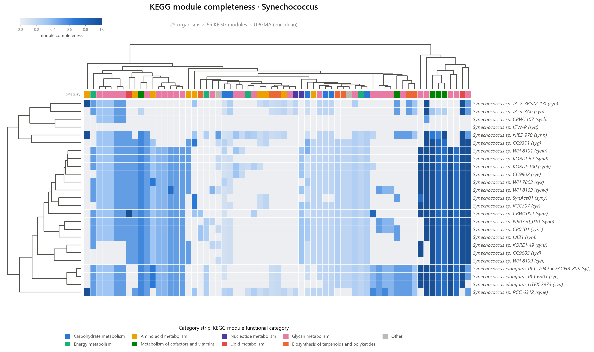
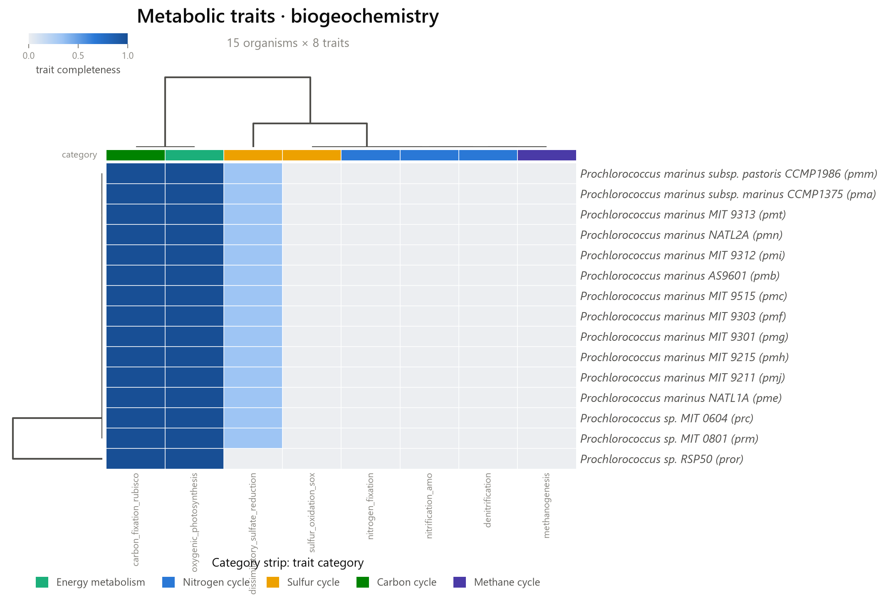
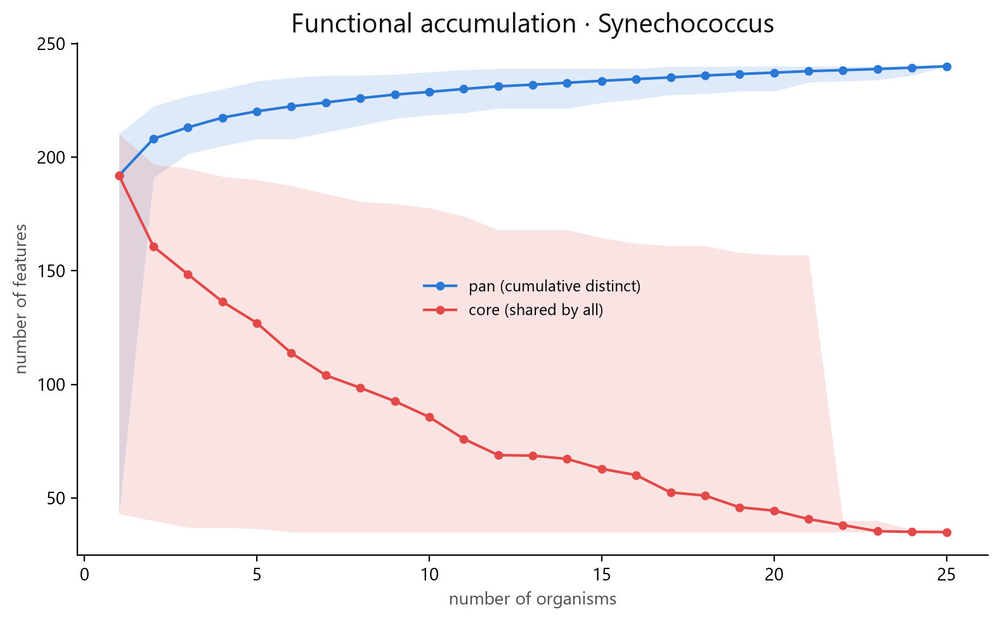
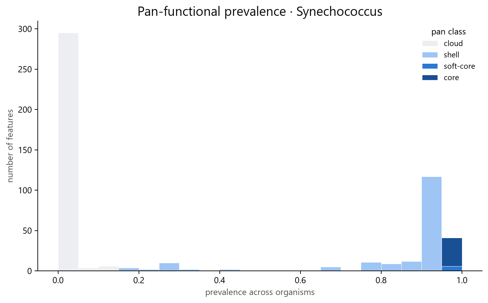
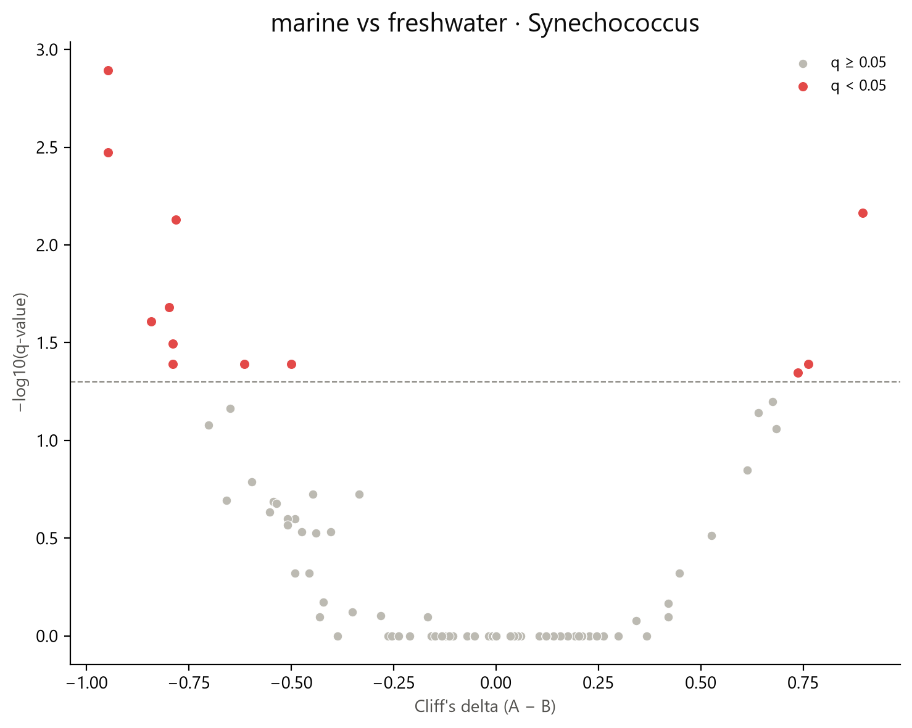
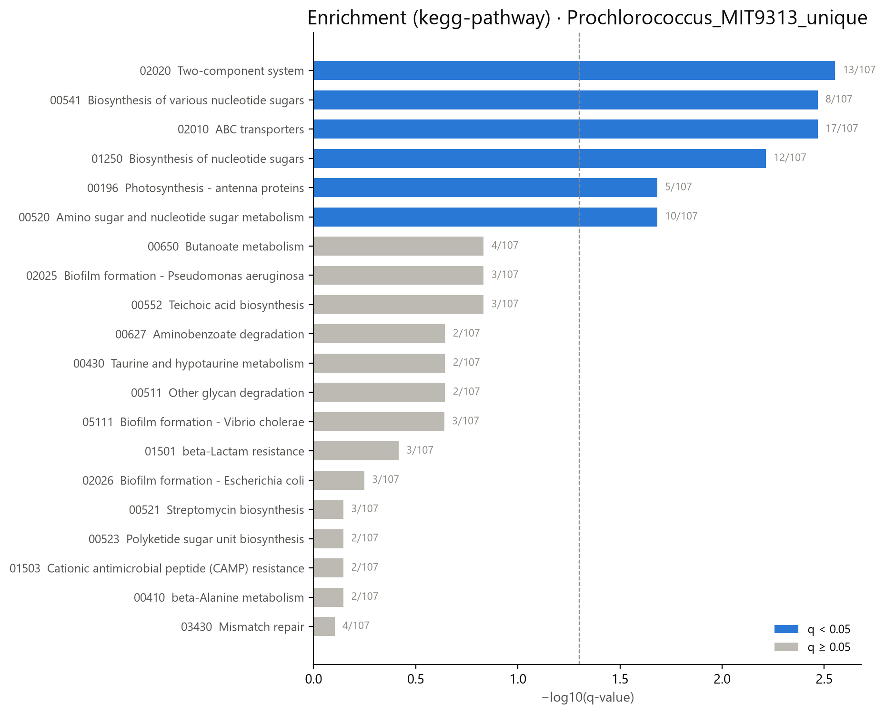
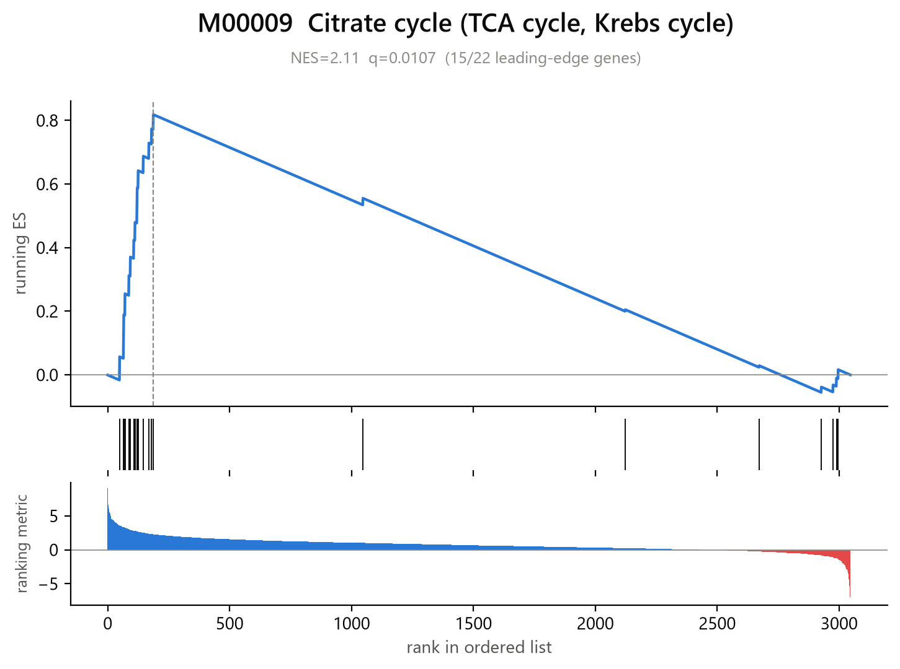
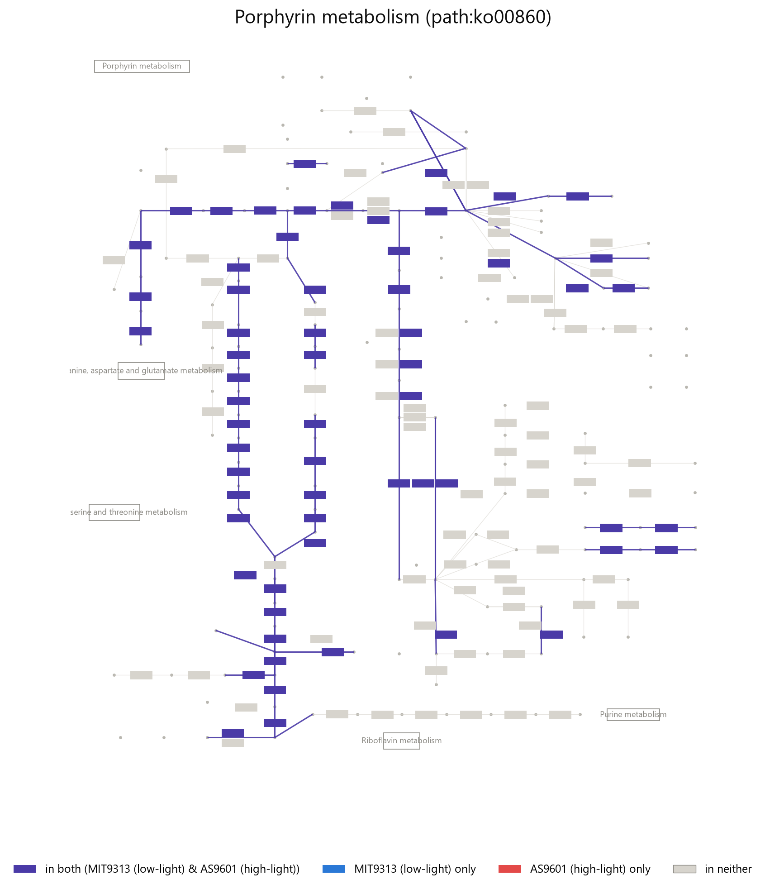

# Metabolic Pathway Presence Heatmap (MPPH)

[](https://github.com/DeweyYihengDu/Metabolic-Pathway-Presence-Heatmap/actions/workflows/ci.yml)
[](https://www.python.org/)
[](LICENSE)
[](https://doi.org/10.1101/2023.06.27.546232)

MPPH profiles KEGG metabolism across a set of genomes and renders a
category-aware heatmap with UPGMA dendrograms. It works two ways:

- **Pathway-map association** — for each genome, whether KEGG provides an
  organism-specific version of a pathway map. This means the pathway *has some
  annotated KOs*, **not** that the complete pathway is present. By default only
  `Metabolism` top-level pathways are kept.
- **Module completeness** — the fraction of each KEGG *module*'s reaction steps
  covered by an organism's KO repertoire (0–1), a far more quantitative signal
  and the recommended mode for metabolic-capability analysis.

It runs on genomes **KEGG already has**, on an explicit **list of organism
codes**, or on **your own MAGs** via their KO annotations. The clustered
dendrogram reflects **functional-profile similarity**, and should not be read as
a sequence-based species phylogeny without external validation.

<p align="center">
  <br>
  <em>Pathway-map association, <code>Prochlorococcus</code> (15 genomes) — cells
  coloured by KEGG functional category, UPGMA-clustered on Jaccard distance.</em>
</p>
<p align="center">
  <br>
  <em>Module completeness, <code>Synechococcus</code> (25 genomes) — the
  dendrogram separates several thermophilic and streamlined strains (top four
  rows) from the rest, visible as a near-empty completeness profile.</em>
</p>

<p align="center">
  <br>
  <em>Trait panel (<code>mpph traits</code>) — every <code>Prochlorococcus</code>
  scores complete carbon fixation (RuBisCO) and oxygenic photosynthesis, and
  (correctly) lacks nitrogen fixation, nitrification and methanogenesis.</em>
</p>

More examples, including the matching `Synechococcus` pathway-presence figure
and every underlying data/QC/tree file, are in [`examples/`](examples/).

### Beyond heatmaps

The analysis subcommands turn a run into comparative figures. Below, the
25-genome `Synechococcus` set (module completeness):

<p align="center">
  
  <br>
  <em><code>mpph pan</code> — an open functional pangenome: the pan set keeps
  growing while the core shrinks and levels off; most modules are accessory
  (prevalence ≈ 0) with a smaller core spike at 1.0.</em>
</p>
<p align="center">
  <br>
  <em><code>mpph compare</code> — differential module completeness between marine
  Synechococcus and six non-marine strains (<em>S. elongatus</em> + thermophilic
  JA isolates); 21 modules at q&lt;0.05 (red). Shown uncorrected; pass
  <code>--tree</code> with a reference phylogeny for phylogenetically
  corrected q-values.</em>
</p>
<p align="center">
  <br>
  <em><code>mpph enrich</code> — KEGG pathway enrichment of the 190 genes in the
  low-light-adapted <em>Prochlorococcus</em> MIT 9313 genome absent from the
  streamlined high-light strain AS9601, tested against MIT 9313's own genome
  as background. The top hit recovers a well-known, published result: low-light
  ecotypes carry extra <em>Photosynthesis – antenna proteins</em> genes (the
  <code>pcb</code> chlorophyll-binding antennae) to harvest scarce light.</em>
</p>
<p align="center">
  <br>
  <em><code>mpph gsea</code> validated against real RNA-seq: 15 samples of
  <em>E. coli</em> under aerobic vs. microaerobic growth
  (<a href="https://www.ncbi.nlm.nih.gov/geo/query/acc.cgi?acc=GSE189154">GEO
  GSE189154</a>, Liou lab), genes mapped Entrez→KEGG gene→KO via KEGG's own
  <code>conv</code>/<code>link</code> endpoints, ranked automatically from
  CPM-normalized counts by <code>mpph gsea --expression ...
  --rank-metric signal2noise</code> (no DE tool involved; KEGG pathway level,
  20,000 permutations to properly resolve near-tied top hits — see
  <a href="docs/methods.md">methods</a>). Top hit: <b>Ribosome</b>
  (51/57 leading-edge genes, NES=2.32, q=0.003) enriched toward aerobic
  growth — bacterial ribosome content scales with growth rate, and aerobic
  respiration supports faster growth than fermentation. The same top-two
  (Ribosome, amino-acid biosynthesis) are recovered independently from the
  study's own published fold-change statistic via <code>--ranked-list</code>.
  <b>Glycolysis, fructose/mannose and pentose-phosphate metabolism</b> go the
  other way, enriched toward microaerobic growth — fermentative sugar
  catabolism stepping in exactly where oxidative respiration can't. A second,
  harder validation — ranking by comparative genomics (KO prevalence, marine
  vs. freshwater <em>Synechococcus</em>) rather than real expression — is in
  <a href="examples/">examples/</a> as an honest "did not clear FDR" case.</em>
</p>
<p align="center">
  <br>
  <em><code>mpph pathmap</code> — the same MIT 9313 vs. AS9601 pair as above,
  now as a KEGG network diagram (KGML layout: enzyme/reaction nodes at KEGG's
  own fixed coordinates) instead of a bar chart. Porphyrin metabolism
  (chlorophyll/heme biosynthesis) comes back entirely <b>shared</b> (purple)
  between the two strains — the core photosynthetic-pigment pathway both
  need, unlike the antenna-protein genes above. <code>--map ko01100</code>
  draws the *entire* global metabolic network the same way (~3,800 reactions,
  every KEGG pathway map stitched into one diagram) if you want the full
  picture rather than one pathway at a time.</em>
</p>

## Features

- **Two profiling analyses** — pathway presence/absence *or* KEGG module completeness.
- **Enrichment** (`mpph enrich`) — hypergeometric over-representation of a gene/KO
  study set against KEGG pathways, KEGG modules, or (with your own gene-to-GO
  mapping) GO terms.
- **Rank-based enrichment / GSEA** (`mpph gsea`) — score *every* gene by an
  expression statistic (or bring your own pre-ranked list) and test whether
  KEGG/GO categories skew toward either end, no significance cutoff needed to
  define a study set first.
- **KEGG pathway/global-map diagrams** (`mpph pathmap`) — a KEGG pathway or
  the entire metabolic network (KGML layout), with enzyme nodes and reactions
  coloured by whether two organism/MAG groups have them: shared, one-only, or
  neither.
- **Local KO annotation** (`mpph annotate`) — no KO annotations yet? Search a
  protein FASTA against KEGG's own KOfam HMM profiles via `pyhmmer`, entirely
  offline after a one-time database download — no external HMMER/KofamScan
  install, generalizes across any species the way KOfam itself does.
- **Three input sources** — a taxon name, a file of organism codes, or your own
  KO annotations (KofamScan / eggNOG / `mpph annotate` / any `K#####` list).
- **Category-aware figures** — a functional-category colour strip + legend,
  gridded cells, UPGMA dendrograms, italic organism labels.
- **Newick export** (`--newick`) — the pathway/module tree for iTOL / FigTree.
- **Informative-feature filtering** — `--drop-core`, `--min/--max-prevalence`,
  and automatic removal of aggregate "Global and overview maps".
- **Robust & reproducible** — on-disk KEGG caching, retries, a run
  `manifest.json` recording the KEGG release, filters, and organism list.

## Installation

```bash
git clone https://github.com/DeweyYihengDu/Metabolic-Pathway-Presence-Heatmap.git
cd Metabolic-Pathway-Presence-Heatmap
pip install .          # or: pip install -e ".[dev]" for development
```

This installs the `mpph` command. Requires Python 3.9+. `mpph annotate`
(local KO annotation) needs the optional `pyhmmer` dependency:
`pip install ".[annotate]"`.

## Usage

```bash
# Pathway presence across a genus (clustered, drop pan-conserved pathways)
mpph Prochlorococcus --cluster --drop-core

# KEGG module completeness, focused on variable modules, export the tree
mpph Prochlorococcus --completeness --cluster --min-prevalence 0.1 \
     --max-prevalence 0.9 --newick

# An explicit set of KEGG organism codes
mpph --codes my_codes.txt --cluster

# Your own MAGs: a directory with one KO list per genome (implies completeness)
mpph --user annotations/ --cluster --format png pdf
```

`mpph` and `python -m mpph` are equivalent.

### Subcommands

`mpph <taxon> …` is a shortcut for `mpph run …`. The full toolkit:

```bash
# Score a metabolic-trait panel (built-in biogeochemistry, or your own JSON/YAML)
mpph traits Prochlorococcus --panel biogeochemistry --cluster

# Explain one module's evidence for one organism (matched / missing KOs per step)
mpph explain Prochlorococcus --module M00002 --organism pmt

# --- these post-process a previous `run --outdir results/` ---
mpph pan        --results results/                       # core/shell/cloud
mpph ordination --results results/ --metadata meta.tsv --color habitat   # PCoA + PERMANOVA
mpph compare    --results results/ --metadata meta.tsv \
                --group-column habitat --group-a surface --group-b deep   # differential
mpph report     --results results/                       # interactive report.html

# Metabolic complementarity across organisms (union completes a module)
mpph community  --codes genomes.txt --max-combination-size 2

# KEGG pathway/module enrichment (ORA) for a study set of genes/KOs
mpph enrich --study unique_genes.txt --background-organism pmt \
            --ontology kegg-pathway

# GO enrichment needs your own gene->GO mapping (KEGG has no GO annotations);
# an eggNOG-mapper .annotations file works directly via --go-map-format eggnog
mpph enrich --study degs.txt --background all_genes.txt --ontology go \
            --gene-go-map sample.emapper.annotations --go-map-format eggnog

# Rank-based (GSEA-style) enrichment from your own DE statistic...
mpph gsea --ranked-list deseq2_stat.tsv --ontology kegg-pathway

# ...or let mpph rank genes from a raw expression matrix + two groups
mpph gsea --expression counts.tsv --metadata meta.tsv --group-column condition \
          --group-a treated --group-b control --ontology kegg-module

# Validate a sample sheet before a user-data run
mpph validate   --samples samples.tsv

# KEGG pathway diagram, coloured by which of two organism groups has each gene
mpph pathmap --map ko00010 --codes-a marine.txt --label-a Marine \
             --codes-b freshwater.txt --label-b Freshwater

# No KO annotations yet? Annotate a protein FASTA locally (one-time db setup,
# then offline) and feed the output straight into --user above
mpph annotate --setup-db .mpph_kofam_db
mpph annotate --fasta genome.faa --out genome_annotated.tsv
```

### Key options

| Option | Description |
| --- | --- |
| `taxon` | Taxon name to query. `--match {word,prefix,exact,regex}` (default `word`). |
| `--codes FILE` / `--user PATH` | Use organism codes, or your own KO annotations (mutually exclusive with a taxon). |
| `--completeness` / `--all-modules` | Score module completeness (0–1); by default only `Pathway` modules. |
| `--top-category` / `--all-categories` | Restrict presence mode to a BRITE top-level category (default `Metabolism`). |
| `--cluster` / `--metric` | UPGMA-cluster both axes. Metric defaults to `jaccard` (presence) / `euclidean` (completeness); also `dice`, `hamming`, `braycurtis`, `cosine`. |
| `--newick` | Export organism and feature trees as `.nwk`. |
| `--drop-core`, `--min/--max-prevalence`, `--present-threshold` | Filter uninformative features by prevalence. |
| `--qc-metadata FILE`, `--min-genome-completeness N` | Join CheckM2/GTDB-Tk-style completeness into `*_qc.csv`; drop MAGs below `N`% completeness and warn on any included MAG below 90% (see [methods](docs/methods.md)). |
| `--format {pdf,png,svg}`, `--outdir DIR` | Figure format(s) and output directory. |
| `--refresh`, `--no-cache`, `--cache-dir` | Control KEGG response caching. |

Run `mpph --help` for the full list.

## Input for your own MAGs

`--user` accepts either:

- **a directory** with one file per genome/MAG (the file stem is the sample
  name); each file is scanned for KO ids, so KofamScan `--format mapper` output
  (`gene<TAB>K#####`) or a bare KO list both work; or
- **a single `sample<TAB>KO` table** (long form).

For eggNOG-mapper output, extract the `KEGG_ko` column into per-sample lists
first.

## Output

For a run on `<name>`, MPPH writes to the output directory:

| File | Contents |
| --- | --- |
| `<name>_matrix.csv` | Organism × feature matrix (0/1 presence, or 0–1 completeness). |
| `<name>_features.csv` | Feature id → name → functional category → top category. |
| `<name>_qc.csv` | Per-organism annotated-feature count and status. |
| `<name>_heatmap.<fmt>` | The figure. |
| `<name>_ordered_matrix.csv`, `<name>_row_order.csv`, `<name>_col_order.csv` | Clustered order, so every column in the figure is traceable. |
| `<name>_organism_tree.nwk`, `<name>_feature_tree.nwk` | Newick trees (with `--newick`). |
| `<name>_manifest.json` | Full command, KEGG release, filters, excluded organisms, output list. |

`mpph enrich` writes `<label>_enrichment.csv` (one row per tested category:
gene/background ratios, fold enrichment, p-value, BH q-value, matching study
items) and `<label>_enrichment.<fmt>` (a bar chart of the top hits).

`mpph gsea` writes `<label>_gsea.csv` (ES, NES, p/q-value, leading-edge genes
per category), `<label>_gsea_summary.<fmt>` (top hits by q-value), and
`<label>_gsea_top.<fmt>` (the classic running-enrichment plot for the #1 hit).
With `--expression`, the computed ranking is also saved as
`<label>_ranked_list.tsv`.

## How it works

1. Resolve organisms from a taxon (`list/genome`), a code file, or user KO files.
2. **Presence:** fetch each organism's pathway list (`list/pathway/<code>`).
   **Completeness:** fetch module definitions (`get/md:` in batches of 10) and
   each organism's KO set (`link/ko/<code>`), then score each module — top-level
   steps split on spaces, `,`=OR, `+`=AND, `-`=optional, `--`=gap (excluded),
   and nested `M#####` references resolved recursively.
3. Assemble and filter the matrix (top-level category, overview maps, empty
   genomes, prevalence).
4. Render the heatmap, clustering when `--cluster` is set, coloured by KEGG
   functional category (`br08901` / module `CLASS`).
5. **Enrichment:** category membership comes from the global (non-organism)
   `link/pathway/ko` or `link/module/ko`; both study and background sets are
   first restricted to genes annotated in that category system, then each
   category is tested with a one-sided hypergeometric test (over-representation
   only) and BH-FDR corrected across all tested categories.
6. **GSEA:** every gene in the ranking is scored (unannotated genes are kept as
   "misses" — unlike enrichment, nothing is dropped to a smaller universe), a
   weighted running-sum statistic is computed per category, and significance
   comes from permuting which genes fall in a category of the same size,
   holding the ranking itself fixed.

## Public Python API (KEGG interface)

The KEGG REST client and the data-access functions are a **public, open part of
the package** — nothing is gated. They always connect directly to the official
KEGG endpoint (`https://rest.kegg.jp`), so you can reuse them to talk to KEGG
programmatically:

```python
import mpph

session = mpph.make_session()            # pooled, retrying HTTPS session

# Low-level: any KEGG REST endpoint, with optional on-disk caching
text = mpph.kegg_get(session, "list/genome", cache_dir=None)
print(mpph.KEGG_API_BASE)                # https://rest.kegg.jp

# Higher-level helpers
genomes = mpph.list_genomes(session, None)
vibrio  = mpph.select_by_taxon(genomes, "Vibrio", match="word")
paths   = mpph.get_pathways(session, "vch", None)     # {map_id: name}
kos     = mpph.organism_kos(session, "vch", None)     # {K#####, ...}
score   = mpph.module_completeness("K00844 K12407 K00845", kos)
```

`mpph.KEGG_API_BASE`, `make_session`, `kegg_get`, `kegg_release`,
`list_genomes`, `select_by_taxon`, `select_by_codes`, `get_pathways`,
`fetch_pathway_categories`, `list_modules`, `fetch_module_definitions`,
`organism_kos`, `fetch_ko_pathway_membership`, `fetch_ko_module_membership`,
`fetch_pathway_names`, `hypergeometric_enrichment`, `load_gene_go_map`,
`gsea_analysis`, `enrichment_score`, `rank_from_expression`, and the
matrix/plot helpers are all exported from the top-level `mpph` package. (Note
the [KEGG terms](DATA_SOURCES.md) apply to the *data* you retrieve; the client
code is MIT-licensed.)

## Limitations

- **`pathway-map` ≠ complete pathway.** A `1` means KEGG lists an
  organism-specific map (some KOs annotated), not that the whole pathway is
  functional. Use `--completeness` for capability analysis.
- **Functional similarity ≠ phylogeny.** The dendrogram clusters KEGG functional
  profiles; horizontal transfer, niche convergence, gene loss, annotation
  coverage and genome completeness all affect it. Validate against a reference
  tree before making evolutionary claims.
- **Genomes are not independent samples.** Close relatives share features by
  descent, so an uncorrected `compare` is anti-conservative — measured Type I
  error reaches 27.7% at a nominal 5% when the two groups are two clades.
  `mpph compare --tree reference.nwk` corrects this against an independent
  reference phylogeny (see [methods](docs/methods.md)); mpph's own dendrogram
  is rejected for this purpose because it is built from the features being
  tested.
- **Annotation depth varies** between genomes, and a MAG's missing features may
  reflect incomplete assembly rather than true absence.
- **Taxon matching is by organism name**, so it is reliable for genus/species
  but not for family/phylum. Results depend on the KEGG release (recorded in the
  manifest).
- **Enrichment is over-representation only** (one-sided; a study set with zero
  hits is reported as non-significant, never as "significantly depleted"), does
  not correct for gene length or study-set composition biases, and **GO
  enrichment needs a gene-to-GO mapping you supply** — KEGG itself has no GO
  annotations.
- **`signal2noise`/`log2fc` in `mpph gsea --expression` are simple, transparent
  ranking statistics, not a substitute for a dedicated differential-expression
  tool** (DESeq2/edgeR/limma model count noise properly). Rank by your own
  tool's statistic via `--ranked-list` for a rigorous analysis. GSEA
  significance is by gene-set permutation (holding the ranking fixed), a good
  default but weaker than phenotype permutation (re-deriving the ranking per
  permutation), which this does not implement.

## Documentation

Full docs are in [`docs/`](docs/): [methods](docs/methods.md),
[input formats](docs/input-formats.md), [subcommands](docs/subcommands.md),
and the [output schema](docs/outputs.md).

## Citation

> Y.-H. Du and J.-H. Mu, "Metabolic-Pathway-Presence-Heatmap (MPPH):
> Constructing phylogenetic trees based on metabolic pathways," bioRxiv, Jun.
> 2023. doi:[10.1101/2023.06.27.546232](https://doi.org/10.1101/2023.06.27.546232)

## License

Released under the [MIT License](LICENSE).
