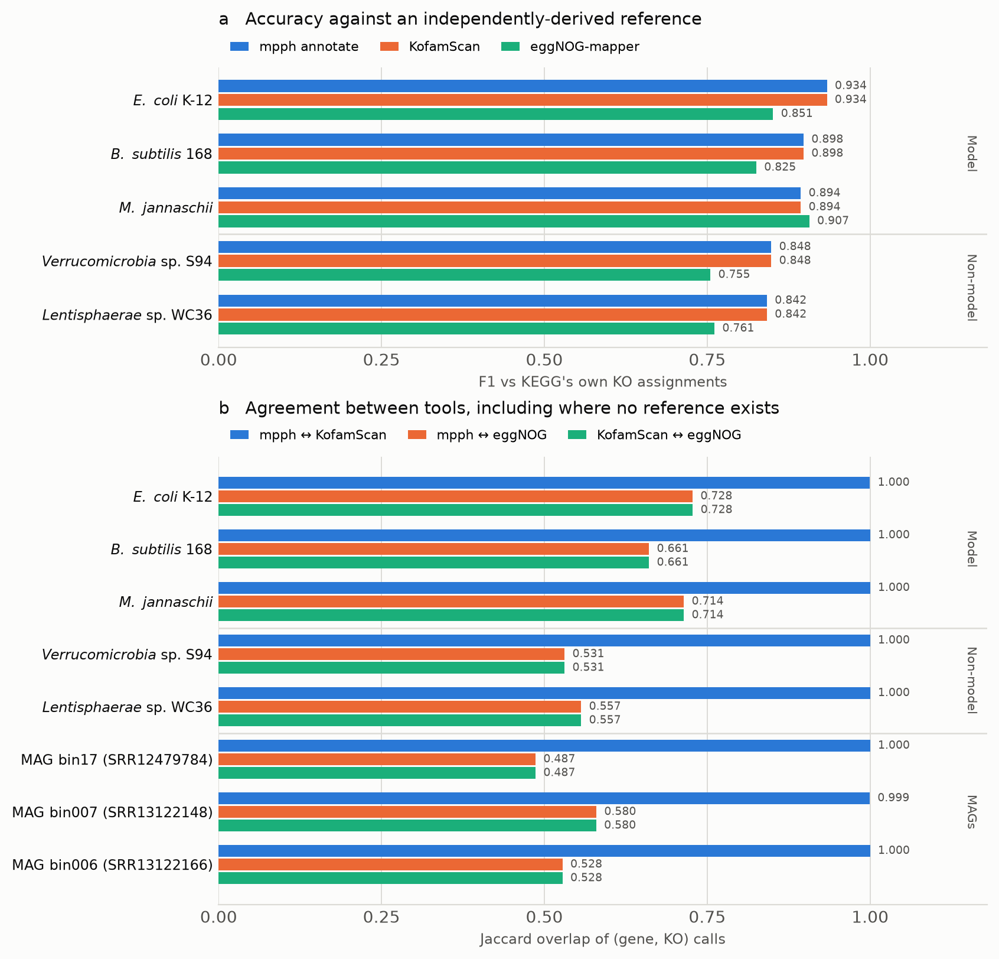

# Annotation benchmark: `mpph annotate` vs. KofamScan vs. eggNOG-mapper

Head-to-head comparison of per-gene KO assignment across three tools, on
three taxonomically diverse organisms with real, KEGG-curated ground truth
(`link/ko/<org>` -- the same official KO assignments KEGG itself publishes
for these genomes, not a synthetic or self-reported benchmark).

## Is the ground truth independent of the tools being tested?

Yes, and this is worth stating explicitly because it is the first thing that
should be checked before trusting any of the accuracy numbers below.

KEGG's own documentation describes the GENES database's KO assignments as
built on **GFIT tables — best-hit sequence-similarity results** — used as
"the basis for both manual and automatic annotation of the GENES database".
KEGG's automatic annotation servers are likewise similarity-based
(BlastKOALA = BLASTP, GhostKOALA = GHOSTX); **KofamKOALA (HMM profile
search) is offered as a separate user-facing service, not as the mechanism
behind GENES annotation itself.**

So the ground truth here is produced by sequence-similarity search plus
curation, whereas `mpph annotate` and KofamScan both score profile HMMs
against per-KO adaptive thresholds. The two are methodologically
independent — recovering KEGG's KO assignments with a profile-HMM method is
a real result, not a restatement of the reference. (eggNOG-mapper is
similarity-based like KEGG's pipeline, which is context for interpreting its
numbers, not an advantage it was given here.)

## Why these organisms

- `eco` -- *Escherichia coli* K-12 MG1655 (Gammaproteobacteria), primary
  validation, ~4,300 genes.
- `bsu` -- *Bacillus subtilis* subsp. *subtilis* 168 (Firmicutes, Gram-positive
  -- a different phylum from *E. coli*).
- `mja` -- *Methanocaldococcus jannaschii* DSM 2661 (Euryarchaeota -- a
  different domain of life).

All three have real KEGG-curated KO assignments, so this measures actual
precision/recall/F1 against ground truth for all three, not "accuracy for
*E. coli*, mere pairwise tool-agreement for the rest."

These three are, however, all long-studied model organisms — the obvious
objection is that KEGG has had decades to curate them, so good accuracy
there says little about the "works for any species" claim this tool actually
makes. Two harder tiers were added for exactly that reason
(`run_nonmodel.sh`):

**Tier 2 — non-model genomes KEGG never hand-curated** (ground truth still
available, so precision/recall are still measured):

| KEGG code | Organism | Accession | Note |
|---|---|---|---|
| `vbs` | *Verrucomicrobia bacterium* S94 | GCA_004299845.1 | PVC superphylum; placeholder strain name, not a named species |
| `lbac` | *Lentisphaerae bacterium* WC36 | GCA_020683205.1 | PVC superphylum; among the most recently added KEGG genomes (T10936) |

Both are environmentally-derived bacteria carrying `bacterium <strain>`
placeholder names rather than species names — i.e. organisms nobody has
built a curated pathway model around.

**Tier 3 — real marine MAGs, the actual target use case** (no ground truth
exists; coverage and pairwise tool agreement only). Metagenome-assembled
genomes with Prodigal gene calls, from marine metagenomes (NCBI SRA runs,
binned with MetaBAT2/DAS Tool). Unlike a finished reference genome these are
incomplete and fragmentary, which is the condition `mpph annotate` is
actually meant to be used under. Selection rule, stated so it is not a
cherry-pick: from bins with 1,000–4,000 predicted proteins (excluding
obvious multi-organism bins, some of which exceed 20,000 proteins), sampled
across that range.

Precision/recall are deliberately **not** reported for Tier 3. Absence of a
reference is not evidence that a call is wrong, and scoring against a
non-existent truth set would manufacture numbers rather than measure
anything.

Genome source: NCBI (the exact assembly accession KEGG itself lists as each
organism's `DATA_SOURCE`, confirmed via `get/gn:<org>`, not assumed):

| Organism | Accession | Assembly name |
|---|---|---|
| `eco` | GCF_000005845.2 | ASM584v2 |
| `bsu` | GCF_000009045.1 | ASM904v1 |
| `mja` | GCA_000091665.1 (GenBank, not RefSeq) | ASM9166v1 |

## Results



Full tables: `results/summary_accuracy.csv`, `results/summary_agreement.csv`.

**`mpph annotate` reproduces KofamScan essentially exactly.** Jaccard overlap
of (gene, KO) calls between the two is **1.000 on six of the eight genomes**,
0.9997 on *E. coli* (one call in 3,517) and 0.9994 on one MAG. This is the
central result: the pyhmmer reimplementation is not merely "comparable" to
the tool it reimplements, it is near-identical call for call — including on
genomes neither tool's authors ever looked at.

**Accuracy holds up as the genomes get harder** (F1 against KEGG's own KO
assignments):

| Tier | Genome | mpph annotate | KofamScan | eggNOG-mapper |
|---|---|---|---|---|
| Model | *E. coli* K-12 | **0.934** | 0.934 | 0.851 |
| Model | *B. subtilis* 168 | **0.898** | 0.898 | 0.825 |
| Model | *M. jannaschii* | 0.894 | 0.894 | **0.907** |
| Non-model | *Verrucomicrobia* sp. S94 | **0.848** | 0.848 | 0.755 |
| Non-model | *Lentisphaerae* sp. WC36 | **0.842** | 0.842 | 0.761 |

The objection this benchmark was built to answer — "your organisms are all
hand-curated model organisms" — does not survive it: the profile-HMM tools'
margin over eggNOG-mapper is *larger* on the two non-model genomes
(+0.09, +0.08 F1) than on the model organisms (+0.08, +0.07), not smaller.
On real MAGs, where no reference exists to score against, mpph and KofamScan
still agree at 1.000/0.999/1.000.

**On eggNOG-mapper's numbers, fairly:** it is not "worse". It annotates
*more* genes (higher coverage on every genome) at lower precision — a
different sensitivity/specificity operating point — and it is
similarity-based, like KEGG's own annotation pipeline, while also producing
far more than KO calls (COG categories, GO, domains). A KO-only F1 is a
narrow slice of what it does.

**Cost, including where mpph is worse.** Wall-clock is comparable — mpph is
faster than KofamScan on five of eight genomes (e.g. 44 s vs 49 s on
*M. jannaschii*), slower on *E. coli* (169 s vs 81 s), 28 threads throughout.
Peak memory is not comparable and this is a genuine limitation of the
implementation, not a reporting artifact (verified against the raw
`/usr/bin/time -v` logs):

| | mpph annotate | KofamScan |
|---|---|---|
| Peak RSS across the eight genomes | **2.3 – 12.3 GB** | 0.13 – 0.72 GB |

10–17× higher, and erratic with input size — *B. subtilis* (4,237 proteins)
peaked at 12.3 GB while the larger *E. coli* (4,300 proteins) peaked at
3.8 GB. The likely cause is pyhmmer's prefetching search strategy (its own
documentation notes prefetch trades "much higher memory consumption" for
speed) compounded by per-thread buffers at `--cpus 28`. Not investigated
further here; recorded because a benchmark that only reports the flattering
numbers is not a benchmark.

## Tools and versions

| Tool | Container | Notes |
|---|---|---|
| `mpph annotate` | this repo, installed from source | pyhmmer + KOfam, see `mpph/kofam.py` |
| KofamScan | `quay.io/biocontainers/kofamscan:1.3.0--hdfd78af_2` | run against the **same** KOfam `profiles/`+`ko_list` as `mpph annotate`, isolating the pyhmmer reimplementation as the only variable |
| eggNOG-mapper | `quay.io/biocontainers/eggnog-mapper:2.1.15--pyhdfd78af_0` | `-m diamond`, full (not taxonomically-restricted) database, matching KofamScan/mpph's always-full-profile-set search |

KOfam database: KEGG's own distribution, downloaded via `mpph annotate
--setup-db` (the same code path this repo ships). eggNOG database: the
default diamond database from `download_eggnog_data.py` (no `-D`/`-H`/`-M`
restriction).

## Reproducing

```bash
# One-time setup (see setup_containers.log / setup_mpph_kofam.log /
# setup_eggnog_db.log in report/ for the exact commands actually run)
singularity pull containers/kofamscan.sif docker://quay.io/biocontainers/kofamscan:1.3.0--hdfd78af_2
singularity pull containers/eggnog-mapper.sif docker://quay.io/biocontainers/eggnog-mapper:2.1.15--pyhdfd78af_0
mpph annotate --setup-db databases/kofam
singularity exec containers/eggnog-mapper.sif download_eggnog_data.py -y --data_dir databases/eggnog

# Run everything + compare
bash run_all.sh
```

## Metrics (`compare_annotation.py`)

For each (organism, tool): coverage (% genes assigned >=1 KO), and
precision/recall/F1 treating each (gene, KO) pair as the unit of comparison
against ground truth (so multi-KO genes are handled correctly, not just
exact-set matches). For each (organism, tool-pair): Jaccard overlap of
(gene, KO) pairs -- symmetric agreement, no designated ground truth needed.
Logic verified against hand-constructed synthetic data with known expected
precision/recall/Jaccard values (`test_compare_annotation.py`) before being
trusted on real tool output.

Raw per-tool outputs and the multi-GB databases themselves are not committed
here (see `.gitignore`) -- only the summary tables in `report/` and the
scripts to regenerate them.
