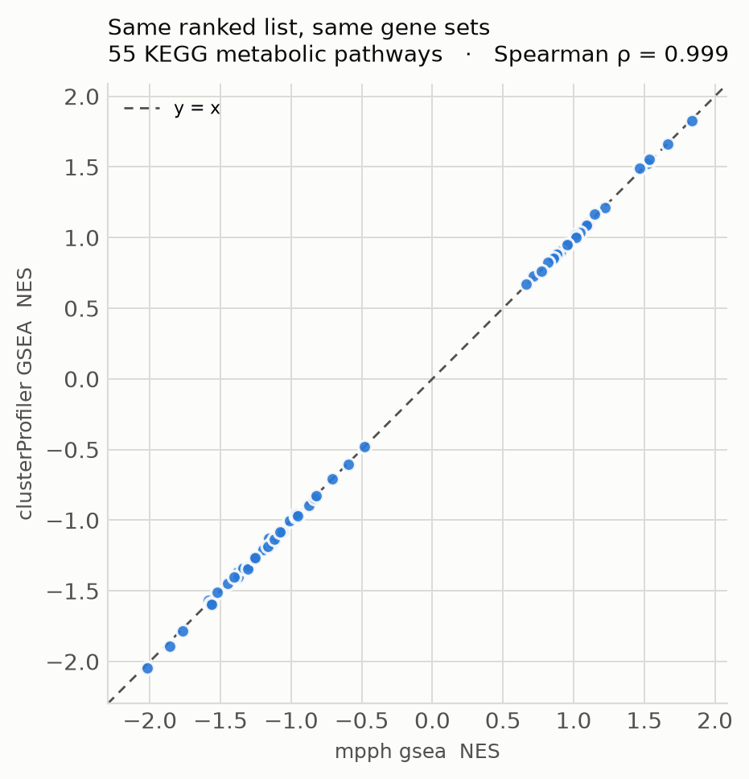

# Enrichment benchmark: `mpph gsea`/`mpph enrich` vs. clusterProfiler

Head-to-head comparison against the reference implementation of functional
enrichment in R (clusterProfiler 4.18.4), for both rank-based enrichment
(GSEA) and over-representation analysis (ORA).

## The comparison is controlled, not just "both were run"

Two things had to be held constant for the numbers to mean anything, and
both are enforced in the scripts rather than assumed:

1. **Identical category definitions.** `export_term2gene.py` exports mpph's
   own KO→pathway membership snapshot (restricted to BRITE `Metabolism`) as
   a clusterProfiler `TERM2GENE` table — 185 pathways, 19,692 (pathway, KO)
   pairs from one KEGG fetch. Both tools are then tested against *that same
   table*, so a difference in result cannot come from a different database
   version.
2. **Identical parameters.** clusterProfiler's `GSEA()` defaults to
   `minGSSize = 10`; `mpph gsea` defaults to `--min-size 15`. Left alone,
   clusterProfiler tested 68 pathways to mpph's 55 and the comparison would
   have measured a parameter mismatch. `run_clusterprofiler.R` sets
   15/500 explicitly. For ORA, the R script exports the exact study and
   background gene lists it used, and `mpph enrich` is then run on those
   same files rather than on an independently-derived DE threshold.

The input is `examples/Ecoli_ranked_logFC.tsv` — real data (GEO GSE189154,
*E. coli* microaerobic vs aerobic), already shipped with this repository.

## Results



Full tables: `enrichment_gsea_comparison.csv`, `enrichment_ora_comparison.csv`.
Per-pathway outputs: `results_mpph_gsea.csv`, `results_clusterprofiler_gsea.csv`.

**GSEA** — 55 pathways tested by both, none tested by only one:

| Metric | Agreement |
|---|---|
| Enrichment score (ES) | Spearman ρ = **1.000** |
| Normalised score (NES) | Spearman ρ = **0.999** |
| p-value | Spearman ρ = **0.994** |
| Significant set (q < 0.05) | Jaccard **0.833** — 5 shared, clusterProfiler calls 1 more |

**ORA** — on the 23 pathways both tools report: p-value Spearman ρ =
**1.000**, significant-set Jaccard **0.867** (13 shared of 15).

mpph reports 113 pathways to clusterProfiler's 23. That gap is **not** a
discrepancy in the test: `enricher()` drops categories with zero study-set
hits from its output entirely, while `mpph enrich` reports them (correctly,
as non-significant, with the counts that justify it). The two tools disagree
about what belongs in an output table, not about any pathway's statistics —
which is why the comparison is computed over the intersection and the
disjoint counts are reported alongside rather than hidden.

## Two ID-handling bugs this benchmark surfaced

Both were in the benchmark harness, not in `mpph` — recording them because
they are the kind of silent failure that produces a confident, wrong table:

- **R's `read.delim()` strips leading zeros.** KEGG pathway ids are
  zero-padded 5-digit strings (`01210`); read without
  `colClasses = "character"` they become integers and come back as `1210`.
  Nothing errors — the join with mpph's ids simply matches zero rows, and
  every correlation reports `NaN`. This is the same failure mode pandas'
  dtype inference causes on the same id shape, in a different language.
- **Category-size defaults differ between the tools** (above). Also silent:
  both runs succeed, they just test different pathway sets.

## Reproducing

```bash
python export_term2gene.py --top-category Metabolism \
    --out term2gene_metabolism.tsv --out-names term2name.tsv
mpph gsea --ranked-list examples/Ecoli_ranked_logFC.tsv \
    --ontology kegg-pathway --top-category Metabolism --label mpph
singularity exec containers/clusterprofiler.sif Rscript run_clusterprofiler.R \
    examples/Ecoli_ranked_logFC.tsv term2gene_metabolism.tsv term2name.tsv results
mpph enrich --study results/study_genes.txt --background results/background_genes.txt \
    --ontology kegg-pathway --top-category Metabolism --min-category-size 2 --label mpph_ora
python compare_enrichment.py --mode gsea  --mpph results/mpph_gsea.csv \
    --clusterprofiler results/clusterprofiler_gsea.csv --out enrichment_gsea_comparison.csv
python compare_enrichment.py --mode ora   --mpph results/mpph_ora_enrichment.csv \
    --clusterprofiler results/clusterprofiler_ora.csv --out enrichment_ora_comparison.csv
```

Container: `quay.io/biocontainers/bioconductor-clusterprofiler:4.18.4--r45hdfd78af_0`.
